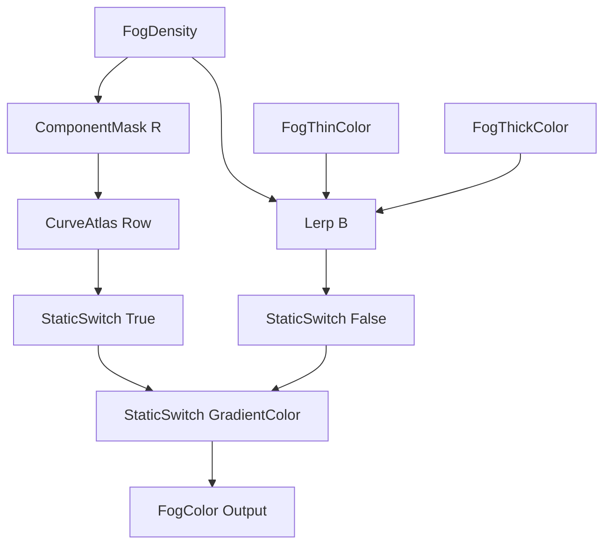

# UE材质转换器 - 测试案例

## 测试案例集合

用于验证转换功能的测试用例。

---

## 测试案例1: 基础数学运算

### 输入（GLSL）
```glsl
float calculate(float2 uv, float time) {
    return sin(uv.x * 10.0 + time) * cos(uv.y * 10.0 + time);
}
```

### 预期输出（HLSL）
```hlsl
float Calculate(float2 UV, float Time)
{
    return sin(UV.x * 10.0 + Time) * cos(UV.y * 10.0 + Time);
}
```

### 验证点
- [ ] vec2 → float2
- [ ] 函数名保持（或转换为PascalCase）
- [ ] 内置函数正确转换

---

## 测试案例2: 插值函数

### 输入（GLSL）
```glsl
vec3 palette(float t, vec3 a, vec3 b, vec3 c, vec3 d) {
    return a + b * cos(6.28318 * (c * t + d));
}
```

### 预期输出（HLSL）
```hlsl
float3 Palette(float t, float3 a, float3 b, float3 c, float3 d)
{
    return a + b * cos(6.28318 * (c * t + d));
}
```

### 验证点
- [ ] vec3 → float3
- [ ] cos函数保持不变
- [ ] 参数类型正确

---

## 测试案例3: Shadertoy完整着色器

### 输入（Shadertoy）
```glsl
void mainImage(out vec4 fragColor, in vec2 fragCoord) {
    vec2 uv = fragCoord / iResolution.xy;
    vec3 col = 0.5 + 0.5 * cos(iTime + uv.xyx + vec3(0, 2, 4));
    fragColor = vec4(col, 1.0);
}
```

### 预期输出（UE Custom节点）
```hlsl
float3 ShaderToyRainbow(float2 UV, float Time)
{
    float3 col = 0.5 + 0.5 * cos(Time + UV.xyx + float3(0.0, 2.0, 4.0));
    return col;
}
```

### 验证点
- [ ] mainImage函数体提取
- [ ] fragCoord/iResolution处理
- [ ] iTime转换
- [ ] vec3类型转换
- [ ] 输入输出说明

---

## 测试案例4: 多函数结构

### 输入（GLSL）
```glsl
float hash(float2 p) {
    return fract(sin(dot(p, vec2(12.9898, 78.233))) * 43758.5453);
}

float noise(float2 p) {
    float2 i = floor(p);
    float2 f = fract(p);
    f = f * f * (3.0 - 2.0 * f);
    float a = hash(i);
    float b = hash(i + vec2(1.0, 0.0));
    float c = hash(i + vec2(0.0, 1.0));
    float d = hash(i + vec2(1.0, 1.0));
    return mix(mix(a, b, f.x), mix(c, d, f.x), f.y);
}
```

### 预期输出（带结构体封装）
```hlsl
struct MS_ValueNoise
{
    float hash(float2 p)
    {
        return frac(sin(dot(p, float2(12.9898, 78.233))) * 43758.5453);
    }

    float noise(float2 p)
    {
        float2 i = floor(p);
        float2 f = frac(p);
        f = f * f * (3.0 - 2.0 * f);

        float a = hash(i);
        float b = hash(i + float2(1.0, 0.0));
        float c = hash(i + float2(0.0, 1.0));
        float d = hash(i + float2(1.0, 1.0));

        return lerp(lerp(a, b, f.x), lerp(c, d, f.x), f.y);
    }

    float compute(float2 Position)
    {
        return noise(Position);
    }
}

MS_ValueNoise_Inst;
return MS_ValueNoise_Inst.compute(Position);
```

### 验证点
- [ ] 结构体创建
- [ ] 静态函数
- [ ] fract → frac
- [ ] mix → lerp
- [ ] vec2 → float2
- [ ] 主函数暴露

---

## 测试案例5: 矩阵操作

### 输入（GLSL）
```glsl
mat2 rotate2d(float angle) {
    return mat2(cos(angle), -sin(angle),
                sin(angle), cos(angle));
}

vec2 transform(vec2 p, float angle) {
    return rotate2d(angle) * p;
}
```

### 预期输出（HLSL）
```hlsl
float2x2 Rotate2D(float Angle)
{
    float s = sin(Angle);
    float c = cos(Angle);
    return float2x2(c, -s, s, c);
}

float2 Transform(float2 p, float Angle)
{
    return mul(Rotate2D(Angle), p);
}
```

### 验证点
- [ ] mat2 → float2x2
- [ ] 矩阵初始化语法
- [ ] 矩阵乘法语法（mul）

---

## 测试案例6: 纹理采样

### 输入（GLSL）
```glsl
vec4 sampleTexture(vec2 uv, sampler2D tex) {
    return texture(tex, uv);
}
```

### 预期输出（UE Custom节点）
```hlsl
float4 SampleTexture(float2 UV, Texture2D Tex)
{
    return Texture2DSample(Tex, TexSampler, UV);
}
```

### 验证点
- [ ] sampler2D → Texture2D
- [ ] texture → Texture2DSample
- [ ] 添加Sampler参数说明

---

## 测试案例7: 条件分支

### 输入（GLSL）
```glsl
float pattern(vec2 uv) {
    if (length(uv) < 0.5) {
        return 1.0;
    } else {
        return 0.0;
    }
}
```

### 预期输出（HLSL）
```hlsl
float Pattern(float2 UV)
{
    if (length(UV) < 0.5)
    {
        return 1.0;
    }
    else
    {
        return 0.0;
    }
}
```

### 验证点
- [ ] 条件语句保持
- [ ] 代码格式

---

## 测试案例8: 循环结构

### 输入（GLSL）
```glsl
float fractal(float2 uv) {
    float value = 0.0;
    for (int i = 0; i < 4; i++) {
        uv = fract(uv * 2.0) - 0.5;
        value += length(uv);
    }
    return value;
}
```

### 预期输出（HLSL）
```hlsl
float Fractal(float2 UV)
{
    float value = 0.0;
    for (int i = 0; i < 4; i++)
    {
        UV = frac(UV * 2.0) - 0.5;
        value += length(UV);
    }
    return value;
}
```

### 验证点
- [ ] 循环保持
- [ ] fract → frac
- [ ] 变量累积

---

## 测试案例9: 向量Swizzle

### 输入（GLSL）
```glsl
vec3 rgb = vec3(1.0, 0.5, 0.0);
vec2 rg = rgb.xy;
float grayscale = dot(rgb, vec3(0.299, 0.587, 0.114));
```

### 预期输出（HLSL）
```hlsl
float3 rgb = float3(1.0, 0.5, 0.0);
float2 rg = rgb.xy;
float grayscale = dot(rgb, float3(0.299, 0.587, 0.114));
```

### 验证点
- [ ] swizzle操作保持

---

## 测试案例10: 复杂着色器（SDF）

### 输入（Shadertoy）
```glsl
float sdSphere(vec3 p, float s) {
    return length(p) - s;
}

float sdBox(vec3 p, vec3 b) {
    vec3 q = abs(p) - b;
    return length(max(q, 0.0)) + min(max(q.x, max(q.y, q.z)), 0.0);
}

float map(vec3 p) {
    float s = sdSphere(p - vec3(0.0, 1.0, 0.0), 1.0);
    float b = sdBox(p - vec3(2.0, 0.5, 0.0), vec3(0.5));
    return min(s, b);
}
```

### 预期输出（带结构体）
```hlsl
struct MS_SDFScene
{
    float sdSphere(float3 p, float s)
    {
        return length(p) - s;
    }

    float sdBox(float3 p, float3 b)
    {
        float3 q = abs(p) - b;
        return length(max(q, 0.0)) + min(max(q.x, max(q.y, q.z)), 0.0);
    }

    float map(float3 p)
    {
        float s = sdSphere(p - float3(0.0, 1.0, 0.0), 1.0);
        float b = sdBox(p - float3(2.0, 0.5, 0.0), float3(0.5));
        return min(s, b);
    }

    float compute(float3 Position)
    {
        return map(Position);
    }
}

MS_SDFScene_Inst;
return MS_SDFScene_Inst.compute(Position);
```

### 验证点
- [ ] 多函数结构体
- [ ] SDF函数正确转换
- [ ] vec3 → float3

---

## 测试案例11: 蓝图节点组合 - 雾颜色插值

### 输入（用户需求描述）
```
需要一个雾颜色混合函数：
- 输入：雾密度(0-1)、薄雾颜色、厚雾颜色
- 在两种颜色之间线性插值
- 可选：使用 Curve Atlas 渐变替代简单插值
- 静态开关控制使用哪种模式
- 输出：最终雾颜色 (RGB)
```

### 预期输出（蓝图节点组合）

**节点组合结构**：
```
输入参数：
- FogDensity (float): 雾密度 [0,1]
- FogThinColor (float3): 薄雾颜色
- FogThickColor (float3): 厚雾颜色  
- UseCurveGradient (bool): 是否使用曲线渐变

节点组合：
1. StaticSwitchParameter (UseCurveGradient)
   ├─ True分支:
   │   └─ CurveAtlasRowParameter
   │       ├─ CurveTime: ComponentMask(FogDensity, R)
   │       └─ 输出: 渐变颜色
   └─ False分支:
       └─ LinearInterpolate
           ├─ A: FogThinColor
           ├─ B: FogThickColor
           └─ Alpha: FogDensity

输出：FogColor (float3)
```

**蓝图复制文本**：
```
Begin Object Class=/Script/UnrealEd.MaterialGraphNode Name="MaterialGraphNode_19"
   Begin Object Class=/Script/Engine.MaterialExpressionLinearInterpolate Name="MaterialExpressionLinearInterpolate_1"
   End Object
   Begin Object Name="MaterialExpressionLinearInterpolate_1"
      A=(Expression="/Script/Engine.MaterialExpressionVectorParameter'MaterialGraphNode_83.MaterialExpressionVectorParameter_0'",Mask=1,MaskR=1,MaskG=1,MaskB=1)
      B=(Expression="/Script/Engine.MaterialExpressionVectorParameter'MaterialGraphNode_84.MaterialExpressionVectorParameter_1'",Mask=1,MaskR=1,MaskG=1,MaskB=1)
      Alpha=(Expression="/Script/Engine.MaterialExpressionReroute'MaterialGraphNode_Knot_2.MaterialExpressionReroute_3'")
      MaterialExpressionEditorX=2688
      MaterialExpressionEditorY=1024
   End Object
   MaterialExpression="/Script/Engine.MaterialExpressionLinearInterpolate'MaterialExpressionLinearInterpolate_1'"
   NodePosX=2688
   NodePosY=1024
End Object

Begin Object Class=/Script/UnrealEd.MaterialGraphNode Name="MaterialGraphNode_57"
   Begin Object Class=/Script/Engine.MaterialExpressionCurveAtlasRowParameter Name="MaterialExpressionCurveAtlasRowParameter_0"
   End Object
   Begin Object Name="MaterialExpressionCurveAtlasRowParameter_0"
      Curve="/Script/Engine.CurveLinearColor'/Game/Textures/CLC_MistyFog.CLC_MistyFog'"
      Atlas="/Script/Engine.CurveLinearColorAtlas'/Game/Textures/CCA_Fog.CCA_Fog'"
      InputTime=(Expression="/Script/Engine.MaterialExpressionComponentMask'MaterialGraphNode_58.MaterialExpressionComponentMask_8'")
      ParameterName="FogColorGradient"
   End Object
   MaterialExpression="/Script/Engine.MaterialExpressionCurveAtlasRowParameter'MaterialExpressionCurveAtlasRowParameter_0'"
   NodePosX=2688
   NodePosY=816
   bCanRenameNode=True
End Object

Begin Object Class=/Script/UnrealEd.MaterialGraphNode Name="MaterialGraphNode_58"
   Begin Object Class=/Script/Engine.MaterialExpressionComponentMask Name="MaterialExpressionComponentMask_8"
   End Object
   Begin Object Name="MaterialExpressionComponentMask_8"
      Input=(Expression="/Script/Engine.MaterialExpressionReroute'MaterialGraphNode_Knot_2.MaterialExpressionReroute_3'")
      R=True
      MaterialExpressionEditorX=2528
      MaterialExpressionEditorY=816
   End Object
   MaterialExpression="/Script/Engine.MaterialExpressionComponentMask'MaterialExpressionComponentMask_8'"
   NodePosX=2528
   NodePosY=816
End Object

Begin Object Class=/Script/UnrealEd.MaterialGraphNode Name="MaterialGraphNode_59"
   Begin Object Class=/Script/Engine.MaterialExpressionStaticSwitchParameter Name="MaterialExpressionStaticSwitchParameter_0"
   End Object
   Begin Object Name="MaterialExpressionStaticSwitchParameter_0"
      A=(Expression="/Script/Engine.MaterialExpressionCurveAtlasRowParameter'MaterialGraphNode_57.MaterialExpressionCurveAtlasRowParameter_0'",Mask=1,MaskR=1,MaskG=1,MaskB=1)
      B=(Expression="/Script/Engine.MaterialExpressionLinearInterpolate'MaterialGraphNode_19.MaterialExpressionLinearInterpolate_1'")
      ParameterName="GradientColor"
   End Object
   MaterialExpression="/Script/Engine.MaterialExpressionStaticSwitchParameter'MaterialExpressionStaticSwitchParameter_0'"
   NodePosX=2912
   NodePosY=976
   bCanRenameNode=True
End Object

Begin Object Class=/Script/UnrealEd.MaterialGraphNode Name="MaterialGraphNode_83"
   Begin Object Class=/Script/Engine.MaterialExpressionVectorParameter Name="MaterialExpressionVectorParameter_0"
   End Object
   Begin Object Name="MaterialExpressionVectorParameter_0"
      DefaultValue=(R=0.846873,G=0.887923,B=1.000000,A=1.000000)
      ParameterName="FogThinColor"
      Group="Color"
   End Object
   MaterialExpression="/Script/Engine.MaterialExpressionVectorParameter'MaterialExpressionVectorParameter_0'"
   NodePosX=2176
   NodePosY=780
   bCanRenameNode=True
End Object

Begin Object Class=/Script/UnrealEd.MaterialGraphNode Name="MaterialGraphNode_84"
   Begin Object Class=/Script/Engine.MaterialExpressionVectorParameter Name="MaterialExpressionVectorParameter_1"
   End Object
   Begin Object Name="MaterialExpressionVectorParameter_1"
      DefaultValue=(R=0.005605,G=0.090842,B=0.250158,A=1.000000)
      ParameterName="FogThickColor"
      Group="Color"
   End Object
   MaterialExpression="/Script/Engine.MaterialExpressionVectorParameter'MaterialExpressionVectorParameter_1'"
   NodePosX=2160
   NodePosY=1056
   bCanRenameNode=True
End Object
```

### 节点连接图示（Mermaid）


### 验证点
- [ ] 使用蓝图节点实现，无需 HLSL
- [ ] StaticSwitch 正确切换两种模式
- [ ] Lerp 节点参数连接正确
- [ ] VectorParameter 默认值正确
- [ ] CurveAtlas 采样正确

### 优势说明
- ✅ 可视化节点连接，易于理解
- ✅ 使用 UE 内置节点，性能优化
- ✅ 参数可在材质实例中调整
- ✅ 无需维护自定义 HLSL 代码
- ✅ 团队成员可直接编辑蓝图

---

## 测试案例12: HLSL Custom 节点 - 复杂噪声算法（对比）

### 输入（相同需求，但算法复杂）
```
需要一个基于 FBM（分形布朗运动）的噪声函数：
- 3D Perlin 噪声
- 多层叠加（可配置迭代次数）
- 时间动画支持
- 输出噪声值 [0,1]
```

### 预期输出（HLSL Custom 节点）

**原因**：FBM 噪声包含多个嵌套函数和循环，蓝图节点无法高效实现。

```hlsl
// Custom节点: PerlinNoiseFBM
// Inputs:
//   - UV (float2): 纹理坐标
//   - Time (float): 时间参数
//   - Scale (float): 缩放系数
//   - Speed (float): 动画速度
//   - Iter (int): 迭代次数
// Output: float - 噪声值 [0,1]

struct MS_PerlinNoiseFBM
{
    float3 hash3(float3 p)
    {
        p = float3(
            dot(p, float3(127.1, 311.7, 74.7)),
            dot(p, float3(269.5, 183.3, 246.1)),
            dot(p, float3(113.5, 271.9, 124.6))
        );
        return -1.0 + 2.0 * frac(sin(p) * 43758.5453123);
    }

    float perlinNoise(float3 p)
    {
        float3 i = floor(p);
        float3 f = frac(p);
        float3 u = f * f * f * (f * (f * 6.0 - 15.0) + 10.0);
        return lerp(
            lerp(
                lerp(dot(hash3(i + float3(0,0,0)), f - float3(0,0,0)),
                     dot(hash3(i + float3(1,0,0)), f - float3(1,0,0)), u.x),
                lerp(dot(hash3(i + float3(0,1,0)), f - float3(0,1,0)),
                     dot(hash3(i + float3(1,1,0)), f - float3(1,1,0)), u.x), u.y),
            lerp(
                lerp(dot(hash3(i + float3(0,0,1)), f - float3(0,0,1)),
                     dot(hash3(i + float3(1,0,1)), f - float3(1,0,1)), u.x),
                lerp(dot(hash3(i + float3(0,1,1)), f - float3(0,1,1)),
                     dot(hash3(i + float3(1,1,1)), f - float3(1,1,1)), u.x), u.y),
            u.z
        ) * 0.5 + 0.5;
    }

    float fbm(float3 p, int iter)
    {
        float value = 0.0;
        float amplitude = 0.5;
        float frequency = 1.0;
        for (int i = 0; i < iter; i++)
        {
            value += amplitude * perlinNoise(p * frequency);
            frequency *= 2.0;
            amplitude *= 0.5;
        }
        return value;
    }

    float compute(float2 uv, float time, float scale, float speed, int iter)
    {
        float3 p = float3(uv * scale + float2(0.0, time * speed), 0.0);
        float col = fbm(p, iter);
        col = pow(saturate(col), 0.4545);
        return col;
    }
}

MS_PerlinNoiseFBM_Inst;
return MS_PerlinNoiseFBM_Inst.compute(UV, Time, Scale, Speed, Iter);
```

### 验证点
- [ ] 使用 struct 封装
- [ ] 辅助函数正确实现
- [ ] compute 函数作为主入口
- [ ] 实例化并调用
- [ ] 噪声值输出范围正确 [0,1]

### 对比说明
| 特性 | 测试案例11（蓝图） | 测试案例12（HLSL） |
|-----|-------------------|-------------------|
| 复杂度 | 简单插值逻辑 | 复杂噪声算法 |
| 节点数量 | 5-7个 | 无法用蓝图实现 |
| 可读性 | 可视化清晰 | 代码更清晰 |
| 性能 | 内置节点优化 | 自定义优化 |
| 可维护性 | 易于调整 | 需理解代码 |
| 适用场景 | 颜色混合、数学运算 | 噪声、SDF、复杂函数 |

---

## 使用测试案例

1. 选择一个测试案例
2. 复制"输入"代码
3. 在Claude中请求转换
4. 与"预期输出"对比
5. 检查"验证点"项目

## 报告问题

如果发现转换结果不符合预期，请提供：
1. 测试案例编号
2. 输入代码
3. 实际输出
4. 预期输出
5. UE版本

这样可以帮助改进转换器的准确性。
